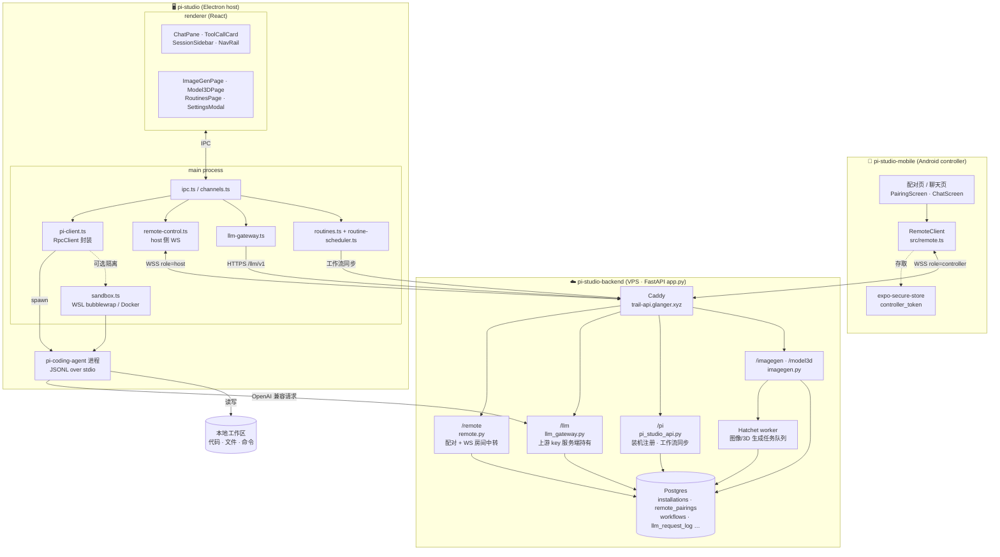
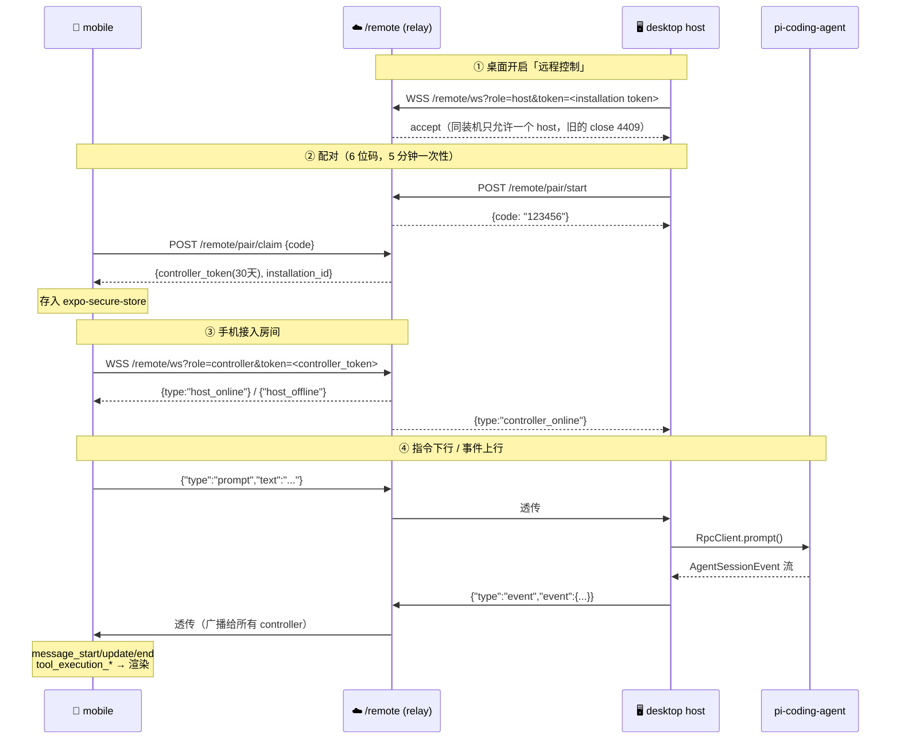

# pi-studio 整体架构

三个仓库组成一套「桌面 coding agent + 云服务 + 手机遥控」系统：

| 仓库 | 角色 | 技术栈 | 部署 |
|------|------|--------|------|
| `pi-studio` | 桌面主体（host） | Electron + electron-vite + React + antd | 本地 Windows/macOS 安装包 |
| `pi-studio-backend` | 云服务（API + 中转 + 网关） | FastAPI + Postgres + Hatchet | VPS，Caddy 反代 `trail-api.glanger.xyz` |
| `pi-studio-mobile` | 手机遥控端（controller） | Expo + React Native + TS | Android APK |

---

## 1. 全局拓扑



---

## 2. 手机遥控链路（本次新增的部分）

中转**不解析消息内容**，纯文本帧透传；一个「装机(installation)」= 一个房间。



**鉴权分层**：`role=host` 用桌面装机 token（比对 `installations.token_hash`）；
`role=controller` 用签名 token（`remote_pairings` + HMAC，30 天过期）。握手失败 close 4401。

⚠️ controller token = 对这台桌面的完全控制权（能跑命令、改代码）。

---

## 3. LLM 调用链路

上游 API key **只存在服务端**，桌面与 agent 都拿不到：

```
pi-coding-agent ──OpenAI 兼容请求──> trail-api/llm/v1/{profile_id}/chat/completions
                                      └─ llm_gateway.py 注入真实 key → 上游厂商
                                      └─ 全量记录 llm_request_log
```

桌面通过 `/llm/session-token` 换取短期凭据，再把 `baseUrl` 指给网关，
配置在 `src/main/llm-gateway.ts` 与 `agent-runtime-config.ts`。

---

## 4. 关键文件索引

**桌面 `pi-studio/src/`**
- `main/pi-client.ts` — 包装 `@earendil-works/pi-coding-agent` 的 `RpcClient`，spawn agent 进程
- `main/remote-control.ts` — host 侧 WS：收指令分发到 RpcClient、转发 agent 事件
- `main/sandbox.ts` / `sandbox-wsl.ts` — 可选把 agent 关进 WSL bubblewrap 或 Docker
- `main/llm-gateway.ts` — 云端 LLM 网关对接
- `main/routines.ts` / `routine-scheduler.ts` — 定时例程
- `renderer/src/components/ChatPane.tsx` — `segmentMessages` 折叠连续工具步、`ThinkingBlock`、流式 index
- `renderer/src/components/ToolCallCard.tsx` — 工具卡 + `SubagentCard`

**云端 `pi-studio-backend/`**
- `app.py` — 挂载 4 个 router
- `remote.py` — 配对 + WS 房间（`Room{host, controllers}`）
- `llm_gateway.py` — profile 管理 + `/v1` 透传
- `pi_studio_api.py` — 装机注册、workflow/run 同步
- `imagegen.py` + `hatchet-worker/` — 图像/3D 生成异步任务
- `database/migrations/` — 012 个迁移，`migrate.py` 随 systemd 启动自动执行

**手机 `pi-studio-mobile/src/`**
- `remote.ts` — `RemoteClient`：claim / WS / 指令 / 事件回调
- `protocol.ts` — 协议类型
- `screens/PairingScreen.tsx` · `screens/ChatScreen.tsx`

---

## 5. 现状与缺口

- 手机端只到 **P0**：纯文本渲染 assistant 消息，未做 Markdown / thinking 折叠 / 工具卡 / 子代理卡（见 `pi-studio-mobile/todo.md` P1–P2）
- 手机端重连是**固定 4 秒**，todo 里写的指数退避尚未实现（`src/remote.ts:57`）
- 中转广播给**所有** controller，多设备同时连会各自收到全量事件流
